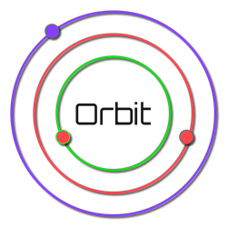

<p align="center">

</p>
<h1 align="center">The Orbit Programming Language</h1>
<hr/>

## What?
<strong>Orbit</strong> is an open source programming language and toolchain that steals lots of good ideas from existing languages and, maybe, invents a few of its own!

## Why?
Orbit is an experiment in less is more. Modern language vendors are shipping some incredible features (huge shout out to Rust, Swift, Go (needs generics!), Crystal etc). Orbit aims to deliver a superset of some (maybe all) of the interesting features found in today's cutting edge languages whilst also trying to remove as many error prone faetures as possible. Here is a short list of examples:

* Can the "if" statement be entirely replaced by pattern matching constructs? Would this reduce logic errors?
* How rich a type system can be built without classical inheritance? Is composition (think Swift's protocols) enough?
* What should the toolchain be automating that programmers currently have to do manually?

## How?
The ultimate goal here is for Orbit to be completely self-hosted. At version 1.0, future updates to the language should be expressible in the language itself (modulo complier bugs) and should be delivered as part of the standard library (or some other offical channel).

However, the language is still in the early stages of development. The project is currently built upon several technologies. The frontend uses [Peg.js](https://pegjs.org/) running on node to build the parser from the grammar defined in [orbit.pegjs](frontend/orbit.pegjs). The backend is built in Swift, targetting LLVM using the excellent [LLVMSwift](https://github.com/trill-lang/LLVMSwift).

# Orbit: A Primer
<hr/>

## The Basics

The following snippet is Orbit's current (shortest) "Hello, World!":

``` orbit
api Hello
	with Orb::Core::Main
	with Orb::Core::FFI
	
	(Main) main (argc Int, argv [ref Int8]) ()
		@CCall(puts, @CString("Hello, World!"))
	...
...
```

The top-level compilation unit in Orbit is the API. An API can be thought of as a module in most respects. An API contains type definitions, methods and some special constructs called Meta Statements.

The `with` keyword imports an external API (in the above example the standard library APIs Main & FFI).

Methods consist of a "Signature" and a body block. Signatures contain a Receiver type, a name, type parameters (optional), a list of argument names & their types (can be empty), and a return type (can be empty, indicating a "void" return). Blocks are closed with three dots `...`, this is called the "shelf".

``` orbit
api MyTypes
	type Foo(x Int)
	type Bar(ref f Foo)
...
```

Types are declared with the `type` keyword followed by a name, a list of properties, and, optionally, a list of trait conformances. Here, the type `Foo` is declared with the property `x` of type `Int`. Internally, types are structs/records. The equivalent type in C would be something like:

``` c
struct Foo {
	int x;
};

struct Bar {
	Foo *f;
};
```

The `ref f Foo` can be thought of as similar to `Foo *f` in C.

Orbit's memory model is subject to change. The finished language will probably be pass-by-reference by default. The `ref` keyword will more than likely disappear in favour of built-in reference types. The above type will look more like:

``` orbit
type Bar(f Foo)
```x